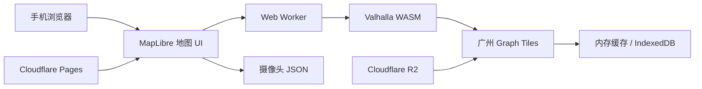
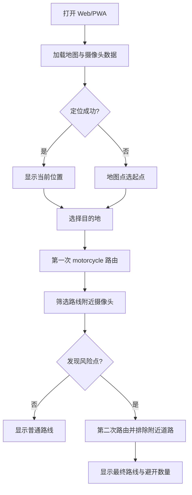

# PeiXiu · 广州摩托导航

> 面向广州的免费 Web/PWA 摩托车辅助导航实验项目


PeiXiu 计划做一个**浏览器本地计算路线**的广州摩托车辅助导航工具：用户选择起点和终点后，在本地完成路线规划，并根据已知摄像头抓拍点位尝试生成避让路线。

项目坚持轻量、免费和可验证，暂时不追求全国覆盖，也不把复杂的禁摩法规全部编码进系统。

## 当前状态

项目目前处于 **方案整理与关键技术 Spike 阶段**，还没有可供日常使用的完整导航应用。

当前最重要的验证顺序：

1. 在浏览器中启动 Valhalla WASM；
2. 读取广州 graph tile；
3. 验证 `motorcycle` 路由；
4. 验证 `exclude_locations` 是否能绕开测试摄像头点位；
5. Spike 通过后，再开始地图 UI 和 PWA 开发。

## 项目边界

### V1 做什么

- 暂时只覆盖广州；
- 使用已知摄像头抓拍点位作为风险点；
- 支持当前位置或地图点选起点；
- 支持地图点选目的地；
- 在浏览器 Web Worker 中计算路线；
- 显示路线、距离、预计时间和避开点位数量；
- 优先使用免费地图数据、静态托管和对象存储。

### V1 不做什么

- 不覆盖全国、省级或跨城市路线；
- 不接入实时交通和实时摄像头数据；
- 不实现完整禁摩法规、时段、车籍和例外规则；
- 不做账号、收藏、社区、后台管理和地址搜索；
- 不承诺“避开摄像头”就等于合法通行。

## 技术路线



### 首选：Valhalla WASM

Valhalla 原生支持 `motorcycle` costing，也提供 `exclude_locations`。但浏览器 WASM、graph tile 按需加载和异步文件系统需要实际验证，因此不会跳过 Spike 直接做完整 UI。

### 备用：omt-router

如果 Valhalla WASM 在浏览器中无法稳定运行，再评估 [omt-router](https://github.com/AbelVM/omt-router)。它更偏向浏览器本地路由，但目前不原生支持摩托车，需要接受汽车路网近似或自行扩展避让逻辑，并评估 AGPL-3.0 许可影响。

## 核心流程



## 设计原则

| 原则 | 做法 |
| --- | --- |
| 先验证关键链路 | 先做 Valhalla WASM Spike，再做完整产品 |
| 本地优先 | 路线计算放在浏览器 Worker，不依赖长期运行的 Routing API |
| 免费优先 | 优先使用 OSM 数据、静态托管和免费额度内的基础设施 |
| 可替换 | 业务层依赖 `RoutingEngine`，路由引擎通过 Adapter 接入 |
| 结果诚实 | 摄像头数据缺失或过期时明确提示，不伪装成法律判断 |

## 文档

- [实施方案（Markdown）](docs/guangzhou-motorcycle-routing-implementation-plan.md)
- [实施方案（HTML）](docs/guangzhou-motorcycle-routing-implementation-plan.html)

实施方案包含技术路线、架构图、核心流程、数据模型、Spike 任务和验收标准。

## 计划中的模块

```text
map/                 地图、当前位置、目的地和路线图层
location/            定位权限与手动选点
routing/             路由接口、Worker 通信和结果标准化
routing/valhalla/    Valhalla WASM 适配器
routing/tiles/       Graph tile 加载、缓存和版本管理
restrictions/        摄像头点位数据与路线走廊筛选
pwa/                 App Shell、Manifest 和 Service Worker
tools/routing-data/  广州 OSM 数据与 Graph tile 构建工具
```

## 免责声明

路线仅供辅助参考。摄像头点位可能存在遗漏、延迟或变更；路线结果不构成对道路通行资格的判断，也不代表避开已知摄像头即可合法通行。请始终以现场交通标志、道路标线和现行交通法规为准。

## License

项目许可证将在首个可运行版本前确定，并在仓库中补充正式的 `LICENSE` 文件。
