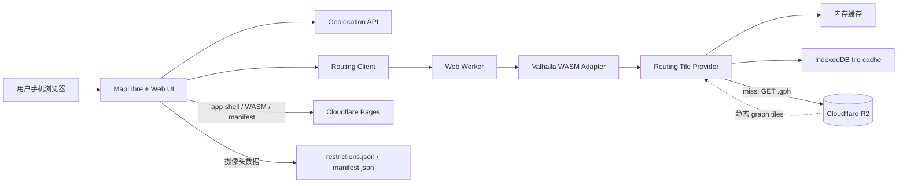
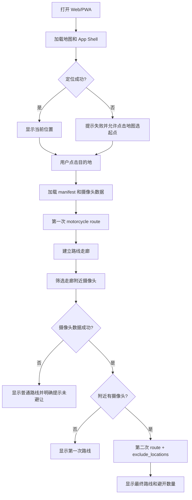
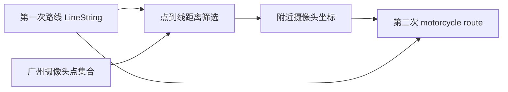
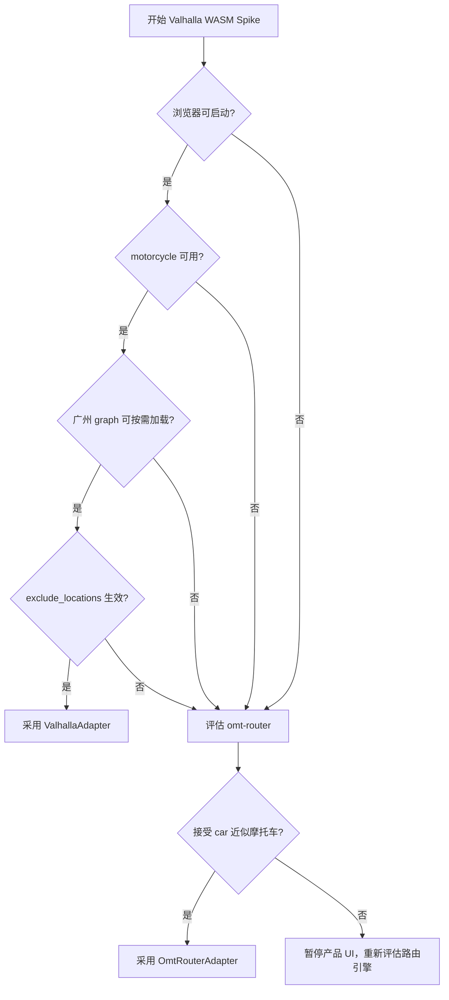

# 广州摩托车摄像头避让导航 Web/PWA 实施方案

> 版本：v1.0
>
> 日期：2026-08-25
>
> 定位：免费、广州范围、浏览器本地路线计算、按已知摄像头点位做简单避让的 MVP。

## 1. 目标与边界

### 1.1 目标

构建一个纯静态 Web/PWA：用户打开页面后获取当前位置，点击地图选择目的地，浏览器在 Web Worker 中完成本地路线计算，并在候选路线附近发现已知摄像头点位后重新规划一条避让路线。

核心约束：

- 不调用远程 `/route` 或其他 Routing API。
- 路线计算在用户浏览器本地完成。
- 广州作为唯一支持区域。
- 首选 Valhalla WASM，必须实际验证 `motorcycle`。
- 摄像头点位只作为风险点，不建模完整交通法规。
- 软件、地图数据和部署优先采用免费方案。

### 1.2 V1 明确不做

- 全国、省级或跨城市路由。
- 地址搜索、POI 搜索、账号、收藏、社区和后台管理。
- 实时交通、实时摄像头同步和在线导航播报。
- 完整禁摩法规引擎、车籍判断、时段判断和例外规则。
- 将“避开已知摄像头”描述成“保证合法通行”。

### 1.3 MVP 产品表述

UI 中使用以下表述：

> 路线仅供辅助参考。摄像头点位可能存在延迟、遗漏或变更，请以实际道路标志和交通法规为准。

路线结果显示：

- 总距离。
- 预计时间。
- 已避开摄像头点位数量。
- 禁摩摄像头数据是否加载成功。

## 2. 技术路线决策

### 2.1 首选路线：Valhalla WASM

Valhalla 官方路由 API 支持 `motorcycle`，也支持 `exclude_locations` 将坐标附近道路排除。[官方 Route API](https://valhalla.github.io/valhalla/api/route/api-reference/)

但是官方 Valhalla 主要面向原生平台和服务端部署，浏览器 WASM 不是现成的低风险产品化能力。因此必须先做 Spike，验证指定 WASM 构建是否能够：

1. 在浏览器启动。
2. 读取真实广州 graph tile。
3. 按需加载缺失 tile。
4. 使用 `motorcycle` 计算路线。
5. 使用 `exclude_locations` 让路线绕开测试摄像头点位。

### 2.2 免费备用路线：omt-router

如果 Valhalla WASM 的图块读取或异步加载无法稳定运行，考察 [omt-router](https://github.com/AbelVM/omt-router)。它已经采用浏览器 Worker、本地图构建、图块缓存和客户端路由，不需要远程 Routing Server。

当前限制：

- 原生支持 car、pedestrian、bicycle，不原生支持 motorcycle。
- 当前项目使用 AGPL-3.0，需要接受对应开源许可义务。
- 摄像头避让需要在其图结构上自行实现最近道路禁用或重新构图。

只有在产品接受“摩托车近似使用 car 路网和速度模型”时，才使用该备用路线。

### 2.3 不作为 V1 首选的候选

- MPEE：MIT 且支持 WASM，但当前公开 profile 主要是 car、bicycle、foot，且偏向单区域整体缓存，不满足 `motorcycle` 首选要求。
- brx/BRouter 类方案：可以作为浏览器离线路由参考，但更接近示例应用，暂不作为本项目核心引擎。
- OSRM、GraphHopper 服务：通常需要路由服务端，不满足“浏览器本地计算、无长期运行后端”的核心约束。

## 3. 总体架构



### 3.1 组件职责

| 模块 | 责任 |
|---|---|
| `map` | 地图、当前位置、目的地、摄像头点和路线图层 |
| `location` | 定位权限、定位失败、点击地图选起点 |
| `routing` | 业务路由接口、Worker 通信、结果标准化 |
| `routing/valhalla` | Valhalla WASM 生命周期、请求转换、响应解析 |
| `routing/tiles` | tile URL、内存缓存、IndexedDB 缓存、版本隔离 |
| `restrictions` | 摄像头 JSON 加载、走廊筛选、计数 |
| `pwa` | manifest、Service Worker、App Shell 缓存 |
| `tools/routing-data` | 广州 OSM 数据下载、graph 构建、manifest 生成 |

## 4. 核心业务流程



### 4.1 两次路线计算

第一次请求：

```json
{
  "locations": [
    {"lat": 23.12, "lon": 113.26, "type": "break"},
    {"lat": 23.13, "lon": 113.28, "type": "break"}
  ],
  "costing": "motorcycle",
  "directions_type": "none"
}
```

第二次请求在附近有摄像头时增加：

```json
{
  "exclude_locations": [
    {"lat": 23.1234, "lon": 113.2678}
  ]
}
```

`exclude_locations` 的语义是排除坐标附近道路，不是识别摄像头本身。MVP 只需要验证路线确实变化并避开测试点附近道路，不扩展到完整法规语义。

## 5. 业务接口

```ts
export type Coordinate = {
  lat: number
  lon: number
}

export type RouteInput = {
  start: Coordinate
  end: Coordinate
  costing: "motorcycle"
  excludeLocations?: Coordinate[]
}

export type RouteResult = {
  distanceMeters: number
  durationSeconds: number
  geometry: GeoJSON.LineString
  avoidedCameraCount: number
  debug?: RoutingDebugInfo
}

export type RoutingEngine = {
  init(): Promise<void>
  route(input: RouteInput): Promise<RouteResult>
  clearCache(): Promise<void>
}
```

业务层只依赖 `RoutingEngine`，不直接依赖 Valhalla JSON、Emscripten FS 或具体 npm wrapper。这样 Valhalla 失败时可以替换为 `OmtRouterAdapter`。

## 6. 摄像头数据模型

V1 保持点位模型：

```json
{
  "version": 1,
  "region": "guangzhou",
  "updatedAt": "2026-08-25",
  "source": "maintained-dataset",
  "cameras": [
    {
      "id": "gz-camera-001",
      "name": "示例路口",
      "lat": 23.123456,
      "lon": 113.123456,
      "type": "motorcycle-camera",
      "description": "已知摩托车相关抓拍点位"
    }
  ]
}
```

实现规则：

- 摄像头点位使用 WGS84，经纬度顺序在业务模型中固定为 `lat/lon`。
- MapLibre GeoJSON 使用 `[lon, lat]`。
- 第一次路线完成后，使用点到路线的距离筛选附近摄像头。
- 初始走廊半径建议 200 米，作为配置项保留。
- `avoidedCameraCount` 表示参与二次规划的摄像头数量，不表示法规上已经绝对安全。



## 7. 图数据与缓存

### 7.1 图数据格式

不把整个广州 graph 打成一个浏览器首次下载的大文件。优先将 Valhalla 输出的单个 `.gph` tile 按版本放入 R2：

```text
routing/
  guangzhou/
    graph-2026-08-25-001/
      manifest.json
      0/xxx/xxx.gph
      1/xxx/xxx.gph
      2/xxx/xxx.gph
```

manifest 至少包含：

```json
{
  "region": "guangzhou",
  "graphVersion": "graph-2026-08-25-001",
  "tileFormat": "valhalla-gph",
  "baseUrl": "https://static.example.com/routing/guangzhou/graph-2026-08-25-001",
  "generatedAt": "2026-08-25T00:00:00Z"
}
```

### 7.2 Tile Provider

```ts
export interface RoutingTileProvider {
  getTile(tileId: string, graphVersion: string): Promise<ArrayBuffer>
  getStats(): TileCacheStats
  clear(graphVersion?: string): Promise<void>
}
```

读取顺序：

```text
Memory Cache
  ↓ miss
IndexedDB(graphVersion + tileId)
  ↓ miss
HTTP GET R2 .gph
  ↓
写入 IndexedDB 和 Memory Cache
```

必须避免新旧 graph 混用。manifest 更新后，客户端使用新的 `graphVersion` 命名空间；旧缓存可以延迟清理。

### 7.3 PWA 缓存边界

Service Worker 第一版只缓存：

- HTML。
- JS/CSS。
- WASM。
- 图标和 manifest。

路由图块由 `RoutingTileProvider` 单独管理，不做全量 precache。

## 8. 实施阶段与验收门

### Phase 0：项目骨架

产出：

- Vite + TypeScript。
- `src/routing/types.ts`。
- 空的 `RoutingEngine` 接口。
- `/spike` 页面入口。
- 基础测试和调试输出。

验收：

```bash
npm install
npm run dev
```

### Phase 1：Valhalla WASM Spike

只做最小页面，不做完整 UI。

验收内容：

- WASM 可以初始化。
- 可以加载小规模测试 graph。
- route 返回 geometry、distance、duration。
- 页面 Network 面板没有远程 route API。

失败处理：

- 记录 WASM 构建 commit、Emscripten 版本、构建参数。
- 不修改业务层接口。
- 进入 `OmtRouterAdapter` 评估。

### Phase 2：motorcycle 与摄像头点避让

测试固定起点、终点和测试摄像头点：

```text
Case A：motorcycle route，无排除点
Case B：在 Case A 路线上放入测试摄像头点，并传 exclude_locations
```

验收：

- Case B 有路线结果。
- Case B 与 Case A 的路线几何或经过道路发生变化。
- Case B 不经过测试点附近道路。
- 不支持时显示错误，不静默降级为 auto。

### Phase 3：广州 graph 和按需加载

产出：

- 广州 OSM 数据构建说明。
- Valhalla graph tile 目录。
- R2 上传目录结构。
- manifest。
- 缺 tile 时的 HTTP 获取。

验收：

- 起点终点在广州范围内可以完成路线。
- 首次路线只下载实际访问的 tile。
- 相同区域第二次路线命中缓存。

### Phase 4：IndexedDB 缓存

产出：

- 按 `graphVersion/tileId` 缓存。
- 缓存统计。
- 清除缓存按钮。
- 失败下载重试。

验收：

- 刷新页面后缓存仍可用。
- 切换 graphVersion 不读取旧 tile。
- 删除缓存后能够重新下载。

### Phase 5：MapLibre 最小 UI

实现：

- 广州底图。
- 当前定位 marker。
- 点击目的地 marker。
- 摄像头 GeoJSON source/layer。
- 候选路线和最终路线 LineString。
- 距离、时间、避开数量。

### Phase 6：GPS 与错误处理

必须覆盖：

- 用户拒绝定位。
- 定位超时。
- 浏览器不支持定位。
- 起点或终点不在广州 graph 范围。
- WASM 初始化失败。
- 图块下载失败。
- 摄像头数据加载失败。
- 无可用路线。

摄像头数据失败时，必须明确显示：

```text
摄像头数据未加载，本次路线未进行摄像头避让。
```

### Phase 7：PWA 与免费部署

产出：

- `manifest.webmanifest`。
- App Shell Service Worker。
- Cloudflare Pages 部署配置。
- R2 静态 graph tile 上传脚本。
- CORS 和缓存头说明。

Cloudflare Pages 免费计划单个静态文件有 25 MiB 限制，因此 WASM 或 graph tile 不应盲目放入 Pages；较大的 graph 数据放 R2。[Pages Limits](https://developers.cloudflare.com/pages/platform/limits/)

## 9. 推荐目录

```text
src/
  app/
    App.ts
  map/
    MapView.ts
    layers.ts
  location/
    geolocation.ts
  routing/
    engine.ts
    types.ts
    worker-client.ts
    worker.ts
    valhalla/
      adapter.ts
      wasm-runtime.ts
    omt-router/
      adapter.ts
    tiles/
      tile-provider.ts
      memory-cache.ts
      indexeddb-cache.ts
  cameras/
    types.ts
    loader.ts
    corridor.ts
  pwa/
    register.ts

public/
  cameras/guangzhou.json
  manifest.webmanifest

spike/
  valhalla-route.html
  test-cases.json

tools/
  routing-data/
    README.md
    build-guangzhou.sh
    upload-r2.sh

tests/
  routing/
  cameras/
```

## 10. 测试方案

### 10.1 单元测试

- 坐标范围和经纬度顺序校验。
- 摄像头 JSON 解析。
- 点到路线距离筛选。
- Valhalla 请求 JSON 生成。
- Valhalla response 解析。
- tile cache 命中、未命中和版本隔离。

### 10.2 集成测试

固定以下输入：

- OSM PBF 文件 checksum。
- Valhalla commit。
- graphVersion。
- 起点。
- 终点。
- 测试摄像头点。

测试重点是道路和点位关系，不比较每一个 geometry 坐标的小数位。

### 10.3 浏览器测试

优先验证：

- Desktop Chrome。
- Android Chrome。
- iPhone Safari。

每个平台记录：

- WASM 下载大小。
- WASM 初始化耗时。
- 首次路线耗时。
- 首次下载 tile 数量和体积。
- 缓存后二次路线耗时。
- 路由失败原因。

## 11. 免费部署方案

```text
代码：GitHub 或其他免费 Git 仓库
前端：Cloudflare Pages
graph tile：Cloudflare R2 Standard
地图：OpenFreeMap 公共实例或自托管 OpenMapTiles
数据：OpenStreetMap + 自维护摄像头 JSON
路线计算：浏览器 WASM / JavaScript Worker
```

R2 当前 Standard 存储有每月 10 GB、100 万次 Class A、1000 万次 Class B 的免费额度，出网流量免费；小规模 MVP 可按零成本设计，但不能承诺无限流量永久免费。[R2 Pricing](https://developers.cloudflare.com/r2/pricing/)

## 12. 流程图：技术路线选择



## 13. MVP 验收标准

```text
[ ] 页面可以显示广州地图
[ ] 可以点击地图设置目的地
[ ] 可以获取 GPS，失败时可以手动选择起点
[ ] 浏览器本地启动路由引擎
[ ] 没有调用远程 route API
[ ] 首选引擎使用 motorcycle
[ ] 可以加载真实广州 graph tile
[ ] graph tile 按需下载
[ ] graph tile 有本地缓存
[ ] 可以加载广州摄像头 JSON
[ ] 可以显示摄像头点位
[ ] 可以进行第二次摄像头避让路线计算
[ ] exclude_locations 或备用引擎的等价禁用道路逻辑实际生效
[ ] 地图显示最终路线
[ ] 显示距离和预计时间
[ ] 显示已避开摄像头数量
[ ] PWA 可以安装
[ ] 可以部署到 Cloudflare Pages + R2
[ ] 小规模使用不依赖付费 Routing API
```

## 14. 最终执行原则

1. 先做 Spike，后做 UI。
2. 先验证能力，不根据 wrapper 类型或 README 猜测。
3. 业务层只依赖 `RoutingEngine`。
4. Valhalla 失败时切换 adapter，不重写整个应用。
5. 摄像头避让只描述为“避开已知点位”。
6. 所有 graph、OSM 和摄像头数据都带版本。
7. 不引入付费地图、搜索或路线 API。
